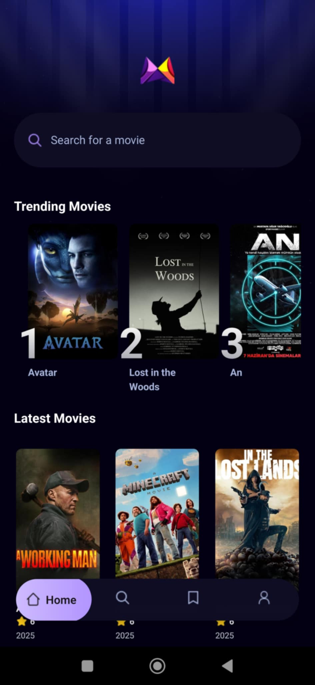
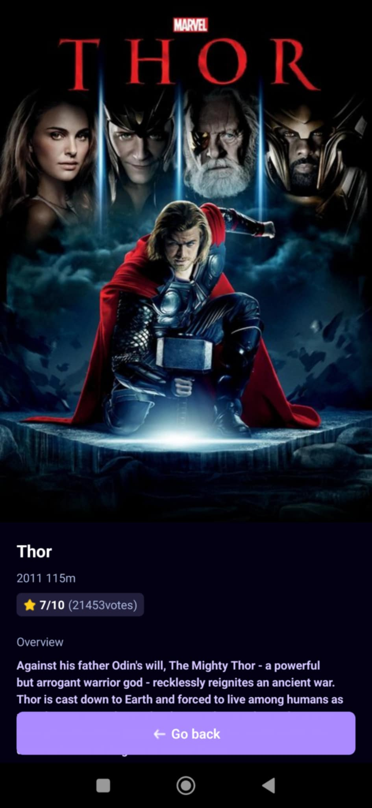

# 🎬 MovieApp

MovieApp is a mobile application built with **React Native (using Expo)** that allows users to browse, search, and explore movies using the **TMDb API**. It also uses **Appwrite** as a Backend-as-a-Service (BaaS) solution for handling trending analytics, user data, and more. This is my **first React Native project**, through which I learned and implemented key mobile development concepts!

---

## 🚀 Features

- 🔍 **Search Movies** – Instantly search for any movie using TMDb.
- 🔥 **Trending Movies** – Discover movies trending based on how often users search for them.
- 🎞️ **Movie Details** – View detailed information like:
  - Budget
  - Revenue
  - Production companies
  - Genres, Release Date, and more.
- 🧠 **Learning Experience** – First project where I learned React Native deeply!
- 🛠️ **Under Development**
  - User **profile page**
  - Save favorite movies to a **watchlist**

---

## 📸 Screenshots (optional)




---

## 🧪 Tech Stack

| Tech                                                                | Description                             |
| ------------------------------------------------------------------- | --------------------------------------- |
| [React Native](https://reactnative.dev/)                            | Cross-platform mobile app framework     |
| [Expo](https://expo.dev/)                                           | Toolchain for React Native apps         |
| [TMDb API](https://www.themoviedb.org/documentation/api)            | Movie data provider                     |
| [Appwrite](https://appwrite.io/)                                    | BaaS for database and user management   |
| [TypeScript](https://www.typescriptlang.org/)                       | Static typing for better dev experience |
| [Tailwind CSS for RN](https://tailwindcss-react-native.vercel.app/) | For styling UI components               |
| [expo-router](https://expo.github.io/router/docs)                   | File-based navigation in Expo apps      |

---

## 🛠️ Getting Started

### 1. Setup environmental variables

##### EXPO_PUBLIC_MOVIE_API_KEY

##### EXPO_PUBLIC_APPWRITE_PROJECT_ID

##### EXPO_PUBLIC_APPWRITE_DATABASE_ID

##### EXPO_PUBLIC_APPWRITE_COLLECTION_ID

### 2. Clone the repo

```bash
git clone https://github.com/your-username/movieapp.git
cd movieapp
```

### 3. Install Dependencies

```bash
npm install
# or
yarn install
```

### 3. Start the app using Expo:

```bash
npx expo start
```
